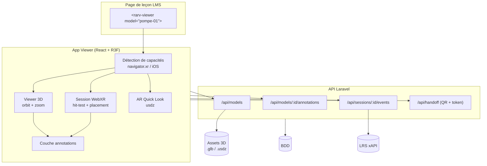

# Projet 01 — Visualiseur d'objets pédagogiques en Réalité Augmentée

> **Pitch CV** : composant web embarquable dans un LMS qui affiche un modèle 3D annoté en réalité augmentée sur le téléphone de l'apprenant, et remonte la traçabilité de la consultation au backend de formation.

---

## 1. Cadrage

### 1.1 Objectif

Permettre à un apprenant, depuis une leçon de son LMS, de cliquer sur un bouton et de faire apparaître un objet 3D pédagogique **dans son environnement réel** via la caméra de son smartphone. Il tourne autour, zoome, et clique sur des points d'intérêt (hotspots) pour lire des fiches d'explication.

### 1.2 Ce qui est dans le périmètre

- Viewer 3D web (desktop + mobile) avec contrôles orbit/zoom
- Mode RA sur mobile (Android **et** iOS, par deux chemins techniques différents)
- Système d'annotations 3D ancrées au modèle, avec fiches de contenu
- Back-office minimal pour créer un objet et poser ses annotations à la souris
- API backend (catalogue, assets, annotations, sessions)
- Traçabilité des consultations (durée, annotations ouvertes, entrée en RA)
- Passerelle « je suis sur desktop → je continue en RA sur mon téléphone » par QR code
- Intégration dans une page LMS via Web Component + iframe

### 1.3 Ce qui est HORS périmètre (à assumer en entretien)

- Application mobile native (Unity / Flutter) — le choix est le **100 % web**, sans store ni installation
- Multi-utilisateur / collaboratif temps réel
- Reconnaissance d'objets réels ou de marqueurs (c'est le **Projet 03**)
- Certification LTI 1.3 complète (prévue en option, Lot 7)

### 1.4 Choix du cas d'usage

Choisir **un seul** objet pour la V1, et le choisir avec des **sous-parties clairement identifiables** (c'est ce qui rend les annotations pertinentes) :

| Candidat | Avantage | Risque |
|---|---|---|
| **Cœur humain** | Modèles libres nombreux, vocabulaire d'annotation évident, universel | Très déjà-vu |
| **Moteur / turbine** | Effet « industriel », valorisant en formation pro | Modèles lourds, souvent payants |
| **Pompe / vanne / compresseur** | Colle au marché de la formation technique, pièces séparables | Moins spectaculaire |
| **Molécule** | Léger, générable par code | Trop simple, peu de valeur perçue |

> **Recommandation** : un **équipement technique** (pompe, moteur thermique simplifié, tableau électrique). C'est le segment où la formation professionnelle achète réellement de la RA, et c'est plus différenciant qu'un cœur humain.

---

### 1.5 Le résultat final : qu'est-ce qu'on obtient, concrètement ?

*(Exemple pris avec une **pompe centrifuge** comme objet pédagogique.)*

#### A — Les 5 choses qui existeront à la fin

Le projet terminé, ce n'est pas « un fichier 3D ». Ce sont **5 adresses web** utilisables :

| # | Adresse | Qui l'utilise | Ce que c'est |
|---|---|---|---|
| 1 | `/lecon/maintenance-pompe` | **Apprenant** | Une page de cours (texte, images) avec le module RA embarqué dedans — la simulation d'une leçon LMS |
| 2 | `/viewer/pompe-01` | **Apprenant** | Le viewer 3D + RA en direct, autonome |
| 3 | `/ar/{token}` | **Apprenant** | Lien de bascule mobile — ouvre directement la RA après scan du QR code |
| 4 | `/admin` | **Formateur** | Back-office : upload d'un objet 3D, pose des annotations à la souris, publication |
| 5 | `/dashboard` | **Formateur** | Suivi : qui a consulté, combien sont passés en RA, quelles annotations sont ignorées |

Plus, en coulisses : une **API REST**, une **base de données**, et un **LRS** (serveur de traçabilité de formation) qui reçoit les déclarations xAPI.

#### B — Le scénario de recette : ce que tu feras pour tester

Ces 5 tests constituent la recette du projet **et** le script de la démo en entretien.

---

**TEST 1 — Sur un téléphone Android** *(le parcours principal)*

1. Tu ouvres `/lecon/maintenance-pompe` dans Chrome sur ton Android
2. Une page de cours s'affiche : titre, texte pédagogique, et un encart avec la photo de la pompe et un bouton **« Explorer en 3D »**
3. Tu tapes → barre de chargement → **la pompe apparaît en 3D** sur fond neutre
4. Tu la fais tourner au doigt, tu zoomes par pincement
5. **5 pastilles numérotées** sont posées sur ses différentes pièces
6. Tu tapes sur la pastille ② → une fiche remonte du bas de l'écran : *« Presse-étoupe — rôle, signes d'usure, procédure de contrôle »* + une photo
7. Tu tapes sur **« Voir en réalité augmentée »** → Android demande l'autorisation caméra → tu acceptes
8. **La vue caméra s'affiche.** Un anneau blanc glisse sur le sol de ta pièce en suivant les mouvements du téléphone
9. Tu tapes → **la pompe se pose par terre, à sa taille réelle** (1,20 m de haut), avec une ombre au sol
10. **Tu marches autour d'elle.** Elle reste plantée au même endroit. Tu peux t'accroupir pour regarder dessous
11. Les 5 pastilles sont toujours accrochées à l'objet dans l'espace → tu tapes sur la ④ → la fiche s'affiche par-dessus le flux caméra
12. Tu pinces pour l'agrandir, tu tapes sur **« Repositionner »** pour la reposer ailleurs
13. Tu quittes la RA → retour au viewer 3D → bandeau : **« 5 / 5 annotations consultées ✓ Activité terminée »**

> ✅ **C'est ça, le projet.** Une pompe industrielle posée dans ton salon, annotée, consultée depuis une leçon, sans avoir rien installé.

---

**TEST 2 — Sur un iPhone** *(le chemin de contournement)*

Étapes 1 à 6 identiques. Puis à l'étape 7, au lieu de WebXR :

7. Tu tapes sur « Voir en réalité augmentée » → **AR Quick Look d'Apple s'ouvre** (l'interface RA native d'iOS)
8. La pompe se pose au sol à la bonne échelle, tu tournes autour, tu la déplaces au doigt
9. Tu fermes → retour au viewer

> ⚠️ Ici les pastilles ne sont **pas** cliquables pendant la RA — c'est la limite d'iOS (Safari ne supporte pas WebXR). Elles se consultent avant, dans le viewer 3D. **C'est assumé et affiché à l'utilisateur**, ce n'est pas un bug.

---

**TEST 3 — Sur un ordinateur** *(la passerelle QR — le moment qui impressionne)*

1. Tu ouvres `/lecon/maintenance-pompe` sur ton PC
2. Le viewer 3D fonctionne à la souris : rotation, zoom, pastilles cliquables avec panneau latéral
3. Tu cliques sur « Voir en réalité augmentée » → message : **« Votre ordinateur ne gère pas la RA — scannez ce QR code avec votre téléphone »** + un QR code
4. Tu scannes avec ton téléphone → il ouvre **directement le mode RA**, sans compte, sans reconnexion
5. Tu poses la pompe chez toi et tu ouvres une annotation
6. **Tu regardes l'écran du PC : sans avoir rien touché, il affiche « ✓ Consulté en RA sur mobile — 3 annotations vues »**

> C'est le moment de la démo qui fait comprendre que ce n'est pas une page 3D isolée, mais **une session partagée entre deux appareils**, gérée par un backend.

---

**TEST 4 — Côté formateur** *(la preuve que ce n'est pas codé en dur)*

1. Tu ouvres `/admin`, tu te connectes
2. Tu cliques **« Nouvel objet »**, tu déposes un fichier `.glb` (par exemple un moteur)
3. Le système vérifie le poids et le nombre de triangles, et **refuse** le fichier s'il dépasse le budget
4. L'objet s'affiche dans un éditeur 3D → **tu cliques directement sur une pièce du modèle** → un formulaire s'ouvre à cet endroit précis
5. Tu saisis le titre et le texte de la fiche → Enregistrer → **la pastille apparaît sur la pièce**
6. Tu répètes 4 fois, tu réordonnes par glisser-déposer, tu cliques **« Publier »**
7. Tu ouvres la leçon : **le nouvel objet est consultable en RA, sans avoir écrit une ligne de code**

---

**TEST 5 — La traçabilité** *(l'argument LMS)*

1. Après les tests précédents, tu ouvres l'interface du **LRS** (Learning Locker)
2. Tu y vois les déclarations xAPI qui sont remontées toutes seules :
   ```
   Learner-42  initialized   Pompe centrifuge — visualisation RA
   Learner-42  experienced   Pompe centrifuge          (mode: WebXR, durée: 3 min 12 s)
   Learner-42  interacted    Annotation 2 — Presse-étoupe
   Learner-42  interacted    Annotation 4 — Roue à aubes
   Learner-42  completed     Pompe centrifuge — visualisation RA
   ```
3. Tu ouvres `/dashboard` : **12 consultations, 8 passages en RA (67 %), durée moyenne 2 min 40 s, l'annotation ④ n'est vue que par 20 % des apprenants**

> Cette dernière ligne est un vrai constat pédagogique : *« le point 4 est mal placé ou mal signalé, il faut le revoir »*. C'est ce qui fait passer le projet de « démo technique » à « outil de formation ».

---

#### C — Ce que ça fait exactement, fonction par fonction

| Fonction | Ce qu'elle fait |
|---|---|
| **Affichage 3D** | Charge un objet 3D optimisé et le rend explorable au doigt ou à la souris, sur n'importe quel appareil |
| **Réalité augmentée** | Détecte le sol via la caméra et pose l'objet à taille réelle dans la pièce, où il reste ancré quand on se déplace |
| **Annotations** | Accroche des points d'explication à des pièces précises de l'objet ; ils suivent ses rotations et disparaissent quand ils passent derrière la géométrie |
| **Bascule QR** | Transfère une session en cours d'un ordinateur vers un téléphone, et renvoie le résultat à l'ordinateur |
| **Back-office** | Permet à un formateur de créer et d'annoter un nouvel objet sans développeur |
| **Traçabilité** | Enregistre chaque consultation, chaque annotation ouverte et chaque passage en RA, et les publie au format standard xAPI |
| **Intégration LMS** | S'insère dans une page de cours via une simple balise, et signale à la plateforme quand l'activité est terminée |

#### D — Ce que ça ne fait PAS *(à dire avant qu'on te le demande)*

- ❌ **Ne reconnaît pas d'objet réel.** Il détecte une surface plane, pas « cette pompe-là devant moi ». La reconnaissance d'objet, c'est le **Projet 03**.
- ❌ **Ne simule rien.** L'objet ne tourne pas, ne fuit pas, ne se démonte pas. C'est un visualiseur annoté, pas un simulateur.
- ❌ **Pas de mode multi-utilisateur.** Un apprenant, une session.
- ❌ **Pas d'application à installer.** C'est un choix, pas un manque : tout passe par le navigateur.

---

## 2. Décisions d'architecture

Ces décisions sont à connaître par cœur : ce sont les questions qui tombent en entretien.

### D1 — Pourquoi WebXR et pas Unity/Flutter ?

Zéro installation, un simple lien depuis le LMS, une seule base de code, déploiement continu. Le prix à payer : moins de puissance graphique et un support iOS partiel (voir D2).

### D2 — Le point critique : iOS ne supporte pas WebXR

**C'est LE piège du projet.** Safari iOS n'implémente pas la session `immersive-ar` de WebXR. Il faut donc **deux chemins RA** :

| Plateforme | Technologie RA | Format 3D | Expérience |
|---|---|---|---|
| **Android** (Chrome, Samsung Internet) | WebXR `immersive-ar` + `hit-test` | `.glb` | RA plein contrôle, hotspots interactifs dans la scène |
| **iOS** (Safari) | AR Quick Look (`<a rel="ar">`) | `.usdz` | RA native Apple, hotspots **non** interactifs |
| **Desktop / non supporté** | Aucune — viewer 3D classique | `.glb` | Orbit + zoom + annotations, bouton « voir en RA » → QR code |

> Conséquence produit : sur iOS, les annotations se consultent **avant** de passer en RA, dans le viewer 3D. À assumer et à documenter — ce n'est pas un bug, c'est une contrainte de plateforme.

### D3 — Three.js brut ou React Three Fiber ?

**React Three Fiber** (R3F). Le rendu 3D devient un arbre de composants React, ce qui permet de piloter les annotations avec l'état React et de réutiliser l'écosystème (`drei`, `@react-three/xr`). Argument CV : montre que la 3D est traitée comme du front moderne, pas comme un script isolé.

> **Plan B si le temps manque** : le composant `<model-viewer>` de Google gère à lui seul WebXR + Quick Look + hotspots. C'est 5× plus rapide à mettre en place, mais tu ne démontres presque aucune compétence 3D. À garder en secours, pas en cible.

### D4 — Où vit le composant par rapport au LMS ?

Application front autonome, embarquée en `<iframe>` (ou Web Component encapsulant l'iframe) dans la leçon. Communication avec la page hôte par `postMessage`, et avec le backend par API REST authentifiée par jeton signé à courte durée de vie.

---

## 3. Stack technique

| Couche | Technologie |
|---|---|
| Rendu 3D | Three.js via **React Three Fiber** + `@react-three/drei` |
| RA | **WebXR Device API** via `@react-three/xr` (Android) / **AR Quick Look** (iOS) |
| Front | React + TypeScript + Vite |
| Backend | **Laravel** (API REST) — ou Node/Express selon préférence |
| Base | MySQL / PostgreSQL |
| Stockage assets | Disque + CDN, ou S3-compatible |
| Optimisation 3D | `gltf-transform` (CLI), Draco/Meshopt, KTX2 |
| Traçabilité | Événements en base + émission **xAPI** vers un LRS |
| Hébergement | HTTPS obligatoire (WebXR et caméra l'exigent) |

---

## 4. Architecture cible



---

## 5. Modèle de données

```
models
  id, slug, title, description, category
  glb_path, usdz_path, poster_path
  default_scale, up_axis, recommended_placement (floor|table|wall)
  triangles, file_size_kb, status (draft|published)

annotations
  id, model_id, order
  position_x, position_y, position_z      -- espace LOCAL du modèle
  normal_x, normal_y, normal_z            -- pour orienter le pin
  label                                    -- texte court affiché sur le pin
  title, body_html                         -- contenu de la fiche
  media_url (nullable), doc_url (nullable)

view_sessions
  id (uuid), model_id, user_ref, lms_context, device_type, xr_supported
  started_at, ended_at, duration_ms, entered_ar (bool)

session_events
  id, session_id, type, payload_json, occurred_at
  -- type ∈ model_loaded | ar_entered | ar_exited
  --        annotation_opened | annotation_closed | model_placed | completed

handoff_tokens
  id, token, model_id, session_id, expires_at, consumed_at
```

---

## 6. LOTS ET ÉTAPES

Découpage en 10 lots. Chaque lot est livrable et démontrable indépendamment.

---

### LOT 0 — Cadrage et socle technique

**Objectif** : un dépôt qui tourne en local, avec les deux applications qui se parlent.

| Étape | Tâche | Livrable |
|---|---|---|
| 0.1 | Figer le cas d'usage (§1.4) et rédiger 5 fiches d'annotation en texte brut | `docs/contenu-pedagogique.md` |
| 0.2 | Créer le dépôt Git, arborescence `/api` (Laravel) + `/viewer` (Vite) + `/docs` | Repo initialisé |
| 0.3 | Initialiser Laravel, configurer BDD, CORS, `.env.example` | `php artisan serve` répond |
| 0.4 | Initialiser Vite + React + TypeScript, installer `three`, `@react-three/fiber`, `@react-three/drei`, `@react-three/xr` | `npm run dev` affiche un cube 3D |
| 0.5 | **Mettre en place HTTPS en local** (mkcert) et l'accès depuis le téléphone sur le même réseau Wi-Fi | Le téléphone ouvre le viewer en `https://` |

> ⚠️ **Étape 0.5 à ne surtout pas repousser.** Sans HTTPS, ni WebXR ni la caméra ne démarrent. Tester depuis un vrai téléphone dès le jour 1 évite de découvrir le problème à la fin.

**Critère de sortie** : un cube 3D s'affiche sur ton téléphone via HTTPS, servi par le front, avec un appel API Laravel qui répond.

---

### LOT 1 — Pipeline des assets 3D

**Objectif** : un modèle optimisé, disponible dans les deux formats, respectant un budget de performance mobile.

| Étape | Tâche | Détail |
|---|---|---|
| 1.1 | Sourcer le modèle | Sketchfab (filtre licence CC), Poly Haven, ou modélisation Blender simplifiée. **Vérifier la licence** et la noter dans `docs/licences.md` |
| 1.2 | Nettoyer sous Blender | Supprimer géométrie invisible, appliquer les transforms, recentrer l'origine au sol de l'objet, orienter +Y vers le haut, mettre à l'échelle en **mètres réels** |
| 1.3 | Exporter en `.glb` | Export glTF 2.0 binaire, textures embarquées |
| 1.4 | Optimiser | `gltf-transform optimize in.glb out.glb --texture-compress ktx2` → compression géométrie (Draco ou Meshopt) + textures KTX2 |
| 1.5 | Générer le `.usdz` iOS | Via `USDZExporter` de Three.js (script Node), l'export USD de Blender, ou Reality Converter sur macOS |
| 1.6 | Générer un poster `.webp` | Image de prévisualisation affichée pendant le chargement |
| 1.7 | Valider le budget perf | Voir tableau ci-dessous |

**Budget de performance mobile (à respecter, pas à négocier)**

| Métrique | Cible | Maximum |
|---|---|---|
| Triangles | ≤ 60 000 | 150 000 |
| Taille `.glb` | ≤ 3 Mo | 8 Mo |
| Textures | 1024² | 2048² |
| Draw calls | ≤ 30 | 60 |
| Framerate en RA | 60 fps | 30 fps |

> **Piège classique** : l'échelle. En RA, une unité glTF = 1 mètre réel. Un modèle exporté « à l'échelle Blender » apparaîtra soit microscopique, soit gigantesque dans le salon. Calibrer en 1.2, pas au runtime.

**Critère de sortie** : `.glb`, `.usdz` et poster présents, budget respecté, `.usdz` validé sur un iPhone réel.

---

### LOT 2 — Backend et API

**Objectif** : l'API qui sert le catalogue, les annotations et encaisse la traçabilité.

| Étape | Tâche |
|---|---|
| 2.1 | Migrations des 5 tables (§5) + modèles Eloquent + relations |
| 2.2 | Seeder avec le modèle du Lot 1 et 5 annotations de test |
| 2.3 | `GET /api/models/{slug}` → métadonnées + URLs signées des assets + annotations |
| 2.4 | `POST /api/sessions` → ouvre une session, retourne un `session_id` (uuid) |
| 2.5 | `POST /api/sessions/{id}/events` → enregistre un événement (accepte un batch) |
| 2.6 | `PATCH /api/sessions/{id}` → clôture, calcul de `duration_ms` |
| 2.7 | Authentification : jeton signé à courte durée (JWT ou URL signée Laravel), émis par la page LMS |
| 2.8 | Rate limiting sur `/events`, validation stricte (FormRequest) |
| 2.9 | Servir les assets avec les bons `Content-Type`, `Cache-Control` long, et **CORS autorisant l'origine du viewer** |
| 2.10 | Tests Feature Pest/PHPUnit sur les 4 endpoints |

> ⚠️ **Étape 2.9** : un `.glb` servi avec un mauvais MIME type ou sans en-tête CORS échoue silencieusement au chargement dans Three.js. Vérifier dans l'onglet Réseau.

**Critère de sortie** : Postman/Bruno parcourt le cycle complet — récupérer un modèle, ouvrir une session, envoyer 3 événements, clôturer.

---

### LOT 3 — Viewer 3D (mode desktop et fallback)

**Objectif** : le socle 3D non-RA, qui doit déjà être excellent seul.

| Étape | Tâche |
|---|---|
| 3.1 | `<Canvas>` R3F, gestion du redimensionnement, `dpr` plafonné à 2 sur mobile |
| 3.2 | Chargement `.glb` avec `useGLTF` + `<Suspense>` + décodeurs Draco/KTX2 configurés |
| 3.3 | Écran de chargement avec poster et pourcentage réel (`useProgress` de drei) |
| 3.4 | Éclairage : HDRI via `<Environment>` + lumière directionnelle + ombre de contact |
| 3.5 | `OrbitControls` avec bornes (distance min/max, angle polaire) pour empêcher de passer sous le sol |
| 3.6 | Recadrage automatique de la caméra sur la bounding box du modèle |
| 3.7 | UI : boutons *Réinitialiser la vue*, *Plein écran*, *Voir en RA* |
| 3.8 | Gestion d'erreur : modèle introuvable, WebGL indisponible, réseau coupé |

**Critère de sortie** : le modèle est explorable au doigt et à la souris, se charge en < 3 s en 4G simulée, sans saccade.

---

### LOT 4 — Système d'annotations

**Objectif** : le cœur pédagogique. C'est ce lot qui transforme une démo 3D en outil de formation.

| Étape | Tâche |
|---|---|
| 4.1 | Composant `<AnnotationPin>` positionné en coordonnées **locales du modèle** (enfant du groupe modèle, donc suit les rotations) |
| 4.2 | Rendu du pin : sphère 3D + `<Html>` de drei avec `occlude="blending"` pour que le pin disparaisse derrière la géométrie |
| 4.3 | Numérotation et état visuel : non visité / visité / actif |
| 4.4 | Panneau latéral (desktop) / feuille du bas (mobile) affichant `title` + `body_html` + média |
| 4.5 | Au clic : animation de la caméra vers le hotspot (`lerp` ou `CameraControls` de drei) |
| 4.6 | Navigation clavier entre annotations (flèches, `Tab`, `Échap` pour fermer) + `aria-label` |
| 4.7 | Barre de progression « 3 / 5 annotations consultées » |
| 4.8 | Émission d'un événement `annotation_opened` vers l'API |

> **Piège** : `<Html occlude>` est coûteux avec beaucoup de hotspots. Au-delà de ~10, basculer sur des sprites 3D + un seul panneau HTML.

**Critère de sortie** : les 5 annotations sont cliquables, lisibles sur mobile, et remontent en base.

---

### LOT 5 — Mode Réalité Augmentée

**Objectif** : le lot le plus visible, et le plus risqué. Le traiter en trois blocs séparés.

#### Bloc A — Détection de capacités

| Étape | Tâche |
|---|---|
| 5.1 | `navigator.xr?.isSessionSupported('immersive-ar')` → booléen, **en async, au montage** |
| 5.2 | Détection iOS + support Quick Look (`document.createElement('a').relList.supports('ar')`) |
| 5.3 | Machine à états d'affichage du bouton : `WEBXR` \| `QUICKLOOK` \| `HANDOFF_QR` \| `INDISPONIBLE` |
| 5.4 | Message explicatif par cas — jamais de bouton mort ni d'erreur brute |

#### Bloc B — WebXR (Android)

| Étape | Tâche |
|---|---|
| 5.5 | Démarrer la session avec les features : `hit-test` (requise), `dom-overlay` + `light-estimation` (optionnelles) |
| 5.6 | `dom-overlay` : afficher l'UI React par-dessus le flux caméra pendant la session |
| 5.7 | **Réticule de placement** : hit-test sur le plan détecté, affichage d'un anneau au sol |
| 5.8 | Au tap : ancrer le modèle à la position du réticule, masquer le réticule |
| 5.9 | Manipulation : pincer pour redimensionner (bornes 0,5× à 2×), glisser à deux doigts pour pivoter, bouton *Repositionner* |
| 5.10 | Ombre projetée au sol (plan avec `shadowMaterial`) — c'est ce qui « colle » l'objet au réel |
| 5.11 | Éclairage adaptatif via `light-estimation` si disponible, valeur par défaut sinon |
| 5.12 | Annotations en RA : pins visibles, tap → fiche dans le `dom-overlay` |
| 5.13 | Sortie propre de la session : `session.end()`, nettoyage, retour au viewer 3D, événement `ar_exited` |

> ⚠️ **L'API de `@react-three/xr` a fortement changé en v6** (`createXRStore`, `<XR store>`) par rapport à la v5 (`<ARButton>`, `<Interactive>`). Verrouiller la version dans `package.json` et suivre **la doc de la version installée**, pas les tutoriels trouvés en ligne.

#### Bloc C — AR Quick Look (iOS)

| Étape | Tâche |
|---|---|
| 5.14 | Lien `<a rel="ar" href="model.usdz"></a>` — l'`` enfant est **obligatoire** pour qu'iOS active le mode RA |
| 5.15 | Paramètres d'URL Quick Look : `#allowsContentScaling=0`, `canonicalWebPageURL`, `callToAction` |
| 5.16 | Événement `ar_entered` envoyé au clic (iOS ne renvoie pas la fin de session — l'assumer et le documenter) |
| 5.17 | Message d'information : « Les annotations se consultent dans le viewer 3D avant le passage en RA » |

**Critère de sortie** : sur un Android réel, l'objet se pose au sol, tient en place quand on tourne autour, et les annotations sont cliquables. Sur un iPhone réel, Quick Look s'ouvre à la bonne échelle.

---

### LOT 6 — Passerelle desktop → mobile (QR code)

**Objectif** : résoudre élégamment le cas « l'apprenant suit sa leçon sur un ordinateur qui ne fait pas de RA ». Fonctionnalité **très différenciante** en entretien.

| Étape | Tâche |
|---|---|
| 6.1 | `POST /api/handoff` → crée un `handoff_token` lié au modèle et à la session, valable 10 minutes |
| 6.2 | Affichage d'un QR code dans une modale du viewer desktop (lib `qrcode`) |
| 6.3 | Route `/ar/{token}` sur le front : consomme le jeton, ouvre directement la session RA sur le téléphone |
| 6.4 | Le téléphone rattache ses événements à la **même** session que le desktop |
| 6.5 | Le desktop poll (ou SSE) l'état de la session et affiche « ✅ Consulté en RA sur mobile » en temps réel |
| 6.6 | Sécurité : jeton à usage unique, expiration, invalidation après consommation |

**Critère de sortie** : scan du QR sur le desktop → RA sur le téléphone → le desktop se met à jour tout seul.

---

### LOT 7 — Intégration LMS et traçabilité

**Objectif** : passer de « démo sympa » à « composant intégrable en production ». **C'est le lot qui fait la différence sur un CV LMS.**

| Étape | Tâche |
|---|---|
| 7.1 | Construire un **Web Component** `<rarv-viewer model="pompe-01" token="…">` encapsulant l'iframe (Shadow DOM) |
| 7.2 | Canal `postMessage` iframe ↔ page hôte : `ready`, `progress`, `completed`, `error` |
| 7.3 | Page de démonstration « fausse leçon LMS » intégrant le composant dans du contenu de cours |
| 7.4 | **Émission xAPI** côté backend : `initialized`, `experienced`, `interacted` (par annotation), `completed` |
| 7.5 | Configuration d'un LRS de test (Learning Locker en Docker, ou SCORM Cloud) + capture d'écran des relevés |
| 7.6 | Règle de complétion configurable : « toutes les annotations vues » ou « ≥ 60 s de consultation » |
| 7.7 | Tableau de bord formateur minimal : par modèle, nombre de vues, taux d'entrée en RA, annotations les moins consultées |
| 7.8 | *(Optionnel, gros effort)* Endpoint **LTI 1.3** : lancement OIDC + Deep Linking + remontée de note via AGS, testé sur un Moodle Docker |

> L'étape 7.4 est l'argument massue : « mon composant RA remonte des déclarations xAPI vers un LRS, il est traçable comme n'importe quelle activité de formation ». L'étape 7.8 est un bonus — ne l'aborder que si les lots 0 à 7.7 sont terminés.

**Critère de sortie** : une consultation complète produit des déclarations xAPI visibles dans le LRS, et la fausse leçon LMS affiche « activité terminée ».

---

### LOT 8 — Back-office de création

**Objectif** : montrer que le contenu est administrable par un formateur, pas codé en dur.

| Étape | Tâche |
|---|---|
| 8.1 | Authentification admin (Laravel Breeze / Sanctum) |
| 8.2 | CRUD des modèles : upload `.glb` + `.usdz`, métadonnées, statut |
| 8.3 | Validation à l'upload : extension, taille, comptage des triangles, refus si hors budget |
| 8.4 | **Éditeur d'annotations visuel** : le modèle s'affiche, un clic sur la surface lance un raycast et récupère point + normale, un formulaire saisit le contenu |
| 8.5 | Liste réordonnable des annotations (drag & drop), édition, suppression |
| 8.6 | Prévisualisation avant publication (`draft` → `published`) |

> L'étape 8.4 est la plus technique du lot : le raycast doit retourner la position en **espace local**, pas en espace monde, sinon les pins se décrochent dès que le modèle tourne.

**Critère de sortie** : créer un nouvel objet annoté de bout en bout sans toucher au code.

---

### LOT 9 — Qualité, performance et accessibilité

| Étape | Tâche |
|---|---|
| 9.1 | Matrice de tests réels : Android Chrome, Samsung Internet, iPhone Safari, desktop Chrome/Firefox/Safari |
| 9.2 | Profilage 3D : compteur de fps, draw calls, `renderer.info` en mode debug |
| 9.3 | Chargement : lazy-load du bundle Three.js, préchargement du `.glb` au survol du bouton, code splitting |
| 9.4 | Accessibilité : navigation clavier complète du viewer, contenu des annotations lisible **hors 3D** (liste HTML alternative), contraste, `prefers-reduced-motion` |
| 9.5 | Tests unitaires (Vitest) sur la détection de capacités et la machine à états |
| 9.6 | Test E2E (Playwright) du parcours desktop — la RA ne s'automatise pas, la tester à la main via une checklist écrite |
| 9.7 | Gestion des erreurs : permission caméra refusée, perte de tracking, WebGL contexte perdu |
| 9.8 | Sécurité : validation des uploads, purification du `body_html` des annotations, URLs d'assets signées |

> L'étape 9.4 n'est pas cosmétique : un contenu de formation doit rester consultable sans 3D. Une **liste HTML des annotations** en alternative est à la fois une exigence d'accessibilité et un excellent argument en entretien.

**Critère de sortie** : la matrice 9.1 est remplie et signée, et un utilisateur au clavier seul peut lire tout le contenu.

---

### LOT 10 — Déploiement et valorisation

| Étape | Tâche |
|---|---|
| 10.1 | Déploiement backend (VPS / Forge / Railway) avec HTTPS valide |
| 10.2 | Déploiement front (Vercel / Netlify / Nginx), variables d'environnement, CSP autorisant le `blob:` des workers 3D |
| 10.3 | Assets 3D derrière un CDN, `Cache-Control` long + hash de version dans le nom de fichier |
| 10.4 | **Vidéo de démonstration de 60 s** : enregistrement d'écran du téléphone montrant le placement RA et l'ouverture d'une annotation |
| 10.5 | `README.md` : problème, architecture, décisions D1–D4, captures, lien de démo, QR code direct |
| 10.6 | `docs/adr/` : une fiche par décision d'architecture, avec les alternatives écartées et pourquoi |
| 10.7 | Page de démo publique avec QR code visible — un recruteur doit pouvoir tester en 10 secondes depuis son téléphone |

> L'étape 10.4 est **non négociable**. La RA ne se raconte pas, elle se montre. Un recruteur ne testera pas toujours, mais il regardera toujours 60 secondes de vidéo.

**Critère de sortie** : une URL publique + un QR code qui lancent la démo sur n'importe quel téléphone.

---

## 7. Planning indicatif

Estimation pour un développeur seul, en rythme projet personnel.

| Lot | Charge | Cumul | Priorité |
|---|---|---|---|
| 0 — Socle | 1 j | 1 j | 🔴 Bloquant |
| 1 — Assets 3D | 1,5 j | 2,5 j | 🔴 Bloquant |
| 2 — Backend | 2 j | 4,5 j | 🔴 Bloquant |
| 3 — Viewer 3D | 2 j | 6,5 j | 🔴 Bloquant |
| 4 — Annotations | 2,5 j | 9 j | 🔴 Cœur produit |
| 5 — Mode RA | 4 j | 13 j | 🔴 Cœur produit |
| 6 — Passerelle QR | 1,5 j | 14,5 j | 🟠 Différenciant |
| 7 — LMS + xAPI | 3 j | 17,5 j | 🔴 Cœur CV |
| 8 — Back-office | 3 j | 20,5 j | 🟠 Différenciant |
| 9 — Qualité | 2 j | 22,5 j | 🟠 Important |
| 10 — Déploiement | 1,5 j | **24 j** | 🔴 Bloquant |

**Chemin critique pour une première démo montrable : Lots 0 → 5, soit ~13 jours.**
Ensuite, prioriser le **Lot 7** (l'argument LMS) avant les lots 6 et 8.

```mermaid
gantt
    dateFormat X
    axisFormat %s
    section Fondations
    Lot 0 Socle          :a0, 0, 1
    Lot 1 Assets 3D      :a1, after a0, 2
    Lot 2 Backend        :a2, after a0, 2
    section Produit
    Lot 3 Viewer 3D      :a3, after a1, 2
    Lot 4 Annotations    :a4, after a3, 3
    Lot 5 Mode RA        :a5, after a4, 4
    section Valeur CV
    Lot 7 LMS + xAPI     :a7, after a5, 3
    Lot 6 QR Handoff     :a6, after a7, 2
    Lot 8 Back-office    :a8, after a6, 3
    section Finition
    Lot 9 Qualité        :a9, after a8, 2
    Lot 10 Déploiement   :a10, after a9, 2
```



---

## 8. Risques identifiés

| # | Risque | Impact | Parade |
|---|---|---|---|
| R1 | iOS ne supporte pas WebXR | Élevé | Double chemin RA (D2), décidé dès le départ, pas contourné en fin de projet |
| R2 | Modèle 3D trop lourd → RA saccadée | Élevé | Budget perf du Lot 1 imposé **avant** le développement |
| R3 | API `@react-three/xr` instable entre versions | Moyen | Version verrouillée, doc de la version installée uniquement |
| R4 | Pas de matériel de test iOS/Android | Élevé | Identifier les appareils de test **à l'étape 0.5**, avant tout développement |
| R5 | Licence du modèle 3D non commerciale | Moyen | Vérification et traçabilité en 1.1 (`docs/licences.md`) |
| R6 | Effet tunnel sur le rendu 3D au détriment du LMS | Élevé | Le Lot 7 est prioritaire sur les lots 6 et 8 — c'est lui qui porte la valeur CV |
| R7 | Tracking RA instable en faible luminosité | Faible | Message d'aide utilisateur + tourner la vidéo de démo en lumière correcte |

---

## 9. Definition of Done

Le projet est terminé quand **tout** ce qui suit est vrai :

- [ ] Un lien public ouvre le viewer sur n'importe quel appareil sans installation
- [ ] Sur Android, l'objet se pose dans la pièce, reste ancré, et ses annotations sont cliquables
- [ ] Sur iOS, AR Quick Look s'ouvre à la bonne échelle depuis le viewer
- [ ] Sur desktop, le viewer 3D est complet et propose le QR code de bascule mobile
- [ ] Les 5 annotations affichent un contenu pédagogique réel, pas du lorem ipsum
- [ ] Une consultation produit des déclarations xAPI visibles dans un LRS
- [ ] Un formateur peut créer un objet annoté depuis le back-office, sans code
- [ ] La matrice de tests navigateurs est remplie
- [ ] Le contenu des annotations est accessible au clavier et lisible hors 3D
- [ ] `README.md`, ADR et vidéo de démonstration de 60 s sont publiés

---

## 10. Ce qu'on met en avant en entretien

**La phrase d'accroche**
> « J'ai développé un composant web embarquable dans un LMS qui affiche des objets pédagogiques en réalité augmentée directement depuis le navigateur du téléphone, sans application à installer, et qui remonte la traçabilité des consultations en xAPI. »

**Les trois points techniques à savoir défendre**

1. **La double stratégie RA** (WebXR sur Android / Quick Look sur iOS) — montre que tu connais les contraintes réelles des plateformes, et pas seulement le tutoriel heureux.
2. **La traçabilité xAPI** — c'est ce qui transforme une démo en composant de formation. C'est le point que la plupart des projets RA de portfolio n'ont pas.
3. **La passerelle desktop → mobile par QR** — un vrai problème produit (le LMS se consulte sur ordinateur, la RA se vit sur téléphone), résolu avec une session partagée et un jeton signé.

**Les questions pièges à préparer**

- *« Pourquoi pas Unity ? »* → arbitrage friction d'installation vs puissance graphique (D1), et le fait que le Projet 03 traite justement le cas où Unity s'impose.
- *« Comment gères-tu les performances sur un téléphone d'entrée de gamme ? »* → budget perf du Lot 1, `dpr` plafonné, Draco/KTX2, dégradation vers le viewer 3D simple.
- *« Que se passe-t-il si l'apprenant n'a pas de téléphone compatible ? »* → machine à états de l'étape 5.3 : jamais de bouton mort, toujours un contenu consultable en 2D.

---

## 11. Suite

- **Projet 02** — Laboratoire / espace de formation interactif à 360° (WebVR / WebGL)
- **Projet 03** — Guide d'assemblage / maintenance pas-à-pas en RA (AR Procedural Training)

Les Lots 0, 2 et 7 (socle, backend, intégration LMS/xAPI) sont **mutualisables** avec le Projet 02 : concevoir le backend dès maintenant comme une plateforme multi-activités fait gagner plusieurs jours sur le projet suivant.
