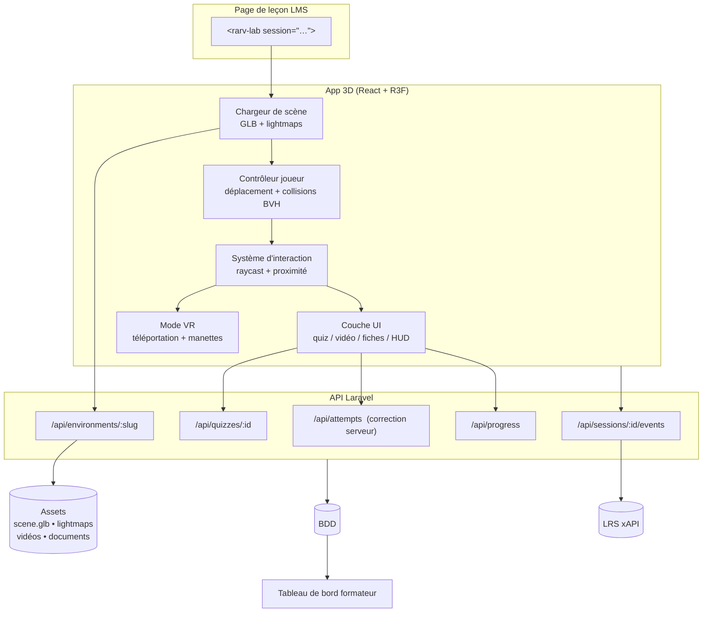

# Projet 02 — Laboratoire / Espace de formation interactif à 360°

> **Pitch CV** : environnement de formation 3D navigable à la première personne, accessible depuis un simple navigateur, dans lequel l'apprenant déclenche des quiz et des vidéos en s'approchant d'objets — avec scoring, progression et traçabilité gérés par un backend Fullstack.

---

## 1. Cadrage

### 1.1 Objectif

Une salle de formation / un laboratoire virtuel en 3D, accessible **sans installation et sans casque**. L'apprenant se déplace en vue première personne, s'approche de postes de travail, de panneaux d'affichage ou d'équipements, et déclenche des activités pédagogiques : quiz noté, vidéo de formation, fiche technique, document à télécharger. Son score et sa progression sont enregistrés côté serveur.

C'est le projet **le plus Fullstack des trois** : la 3D n'y est qu'une interface, la valeur est dans la chaîne front ↔ API ↔ base ↔ LMS.

### 1.2 Ce qui est dans le périmètre

- Environnement 3D d'une pièce (labo ou salle technique), navigable à la première personne
- Déplacement clavier/souris (desktop), joystick tactile (mobile), téléportation (casque)
- Collisions : l'apprenant ne traverse ni les murs ni le mobilier
- Points d'intérêt interactifs : surbrillance au survol, activation au clic ou par proximité
- 4 types d'activités : **quiz noté**, **vidéo**, **panneau d'information**, **document**
- Correction des quiz **côté serveur**, scoring, sauvegarde et reprise de progression
- Mode VR casque via WebXR (Meta Quest Browser) — lot optionnel mais très différenciant
- Intégration LMS (Web Component + iframe) et traçabilité xAPI
- Tableau de bord formateur : scores, taux de complétion, questions les plus ratées

### 1.3 Ce qui est HORS périmètre

- Multi-joueur / classe virtuelle synchrone (session partagée, avatars, voix)
- Éditeur de niveau dans le navigateur — la scène est produite sous Blender
- Physique complète (objets manipulables, gravité sur les props)
- Génération procédurale de salles

### 1.4 Choix de l'environnement

| Candidat | Avantage | Risque |
|---|---|---|
| **Laboratoire de chimie / biologie** | Postes lisibles, vocabulaire pédagogique évident, assets libres nombreux | Attendu, peu différenciant |
| **Atelier technique / maintenance** | Colle au marché de la formation pro, cohérent avec les projets 01 et 03 | Modélisation plus longue |
| **Salle de contrôle / poste électrique** | Fort effet visuel (écrans, voyants), quiz de sécurité crédibles | Éclairage dynamique coûteux |
| **Salle de classe augmentée** | Le plus rapide à produire | Le moins impressionnant |

> **Recommandation** : un **atelier technique / salle de maintenance**. Il prolonge le fil conducteur des trois projets (formation professionnelle industrielle) et permet de réutiliser l'objet 3D du Projet 01 comme équipement posé dans la salle — cohérence de portfolio immédiate.

**Dimensionner petit** : une seule pièce de 10 × 8 m avec 6 à 8 points d'intérêt. Une grande scène ne rapporte aucun point supplémentaire et multiplie les problèmes de performance.

---

## 2. Décisions d'architecture

### D1 — Vraie scène 3D ou panoramas 360° ?

Deux interprétations possibles du « 360° », très différentes en coût :

| Approche | Principe | Coût | Ce que ça démontre |
|---|---|---|---|
| **Panoramas équirectangulaires** | Photos/rendus 360° reliés par des hotspots, façon Street View | Faible | Peu de compétence 3D |
| **Scène 3D navigable** ✅ | Vraie géométrie, déplacement libre, collisions | Élevé | Moteur 3D, collisions, perf, interaction |

**Cible retenue : la scène 3D navigable.** Le déplacement libre en vue première personne est ce que l'énoncé décrit, et c'est ce qui a de la valeur technique.

> **Plan B assumé** : si la production 3D dérape (Lot 1), basculer sur des panoramas 360° rendus depuis Blender avec des hotspots. Toute la couche pédagogique (Lots 2, 6, 7, 9) reste identique — c'est précisément pourquoi l'architecture sépare l'environnement des activités.

### D2 — A-Frame ou React Three Fiber ?

**React Three Fiber**. A-Frame est plus rapide à démarrer (HTML déclaratif, VR intégrée) mais son modèle à entités masque le moteur et se marie mal avec une UI React complexe — or ici l'UI (quiz, panneaux, HUD, progression) est la moitié du travail. R3F donne la 3D **et** l'écosystème React, et partage la stack avec le Projet 01.

### D3 — Comment gérer les collisions ?

Trois options, par ordre de complexité :

| Option | Outil | Verdict |
|---|---|---|
| Capsule vs BVH | `three-mesh-bvh` | ✅ **Retenu** — standard de l'écosystème Three.js, léger, précis |
| Moteur physique | `@react-three/rapier` | Surdimensionné : on ne simule rien, on empêche juste de traverser un mur |
| Navmesh | `three-pathfinding` | Contraint le déplacement à une surface pré-calculée — moins libre, mais très robuste |

Retenu : **capsule de collision testée contre un BVH** construit sur un **mesh de collision simplifié** (pas sur la géométrie visible, qui est trop dense).

### D4 — Éclairage : dynamique ou précalculé ?

**Précalculé (lightmaps baked sous Blender).** Un éclairage dynamique avec ombres temps réel effondre le framerate mobile. On bake l'éclairage dans des textures au moment de la production, et la scène tourne ensuite avec quasiment aucune lumière temps réel. C'est la décision qui détermine si le projet est jouable sur téléphone ou non.

### D5 — Où est corrigé le quiz ?

**Sur le serveur, jamais dans le navigateur.** Le front ne reçoit jamais l'indicateur de bonne réponse. Il envoie les réponses choisies, le backend corrige, calcule le score et renvoie le résultat. C'est une évidence en formation notée, et c'est un point que les projets de portfolio ratent presque toujours.

---

## 3. Stack technique

| Couche | Technologie |
|---|---|
| Rendu 3D | Three.js via **React Three Fiber** + `@react-three/drei` |
| Collisions | **`three-mesh-bvh`** (capsule vs BVH) |
| VR casque | **WebXR `immersive-vr`** via `@react-three/xr` |
| Front | React + TypeScript + Vite + Zustand (état de session) |
| Production 3D | **Blender** (modélisation, UV2, baking lightmaps) |
| Optimisation | `gltf-transform`, Draco/Meshopt, textures KTX2 |
| Backend | **Laravel** (API REST) |
| Base | MySQL / PostgreSQL |
| Traçabilité | Événements en base + **xAPI** vers un LRS |
| Hébergement | HTTPS obligatoire (WebXR) |

---

## 4. Architecture cible



---

## 5. Modèle de données

```
environments
  id, slug, title, description
  scene_glb_path, collision_glb_path, lightmap_paths_json
  spawn_position, spawn_rotation
  bounds_json, triangles, file_size_kb, status

interaction_points
  id, environment_id, order, code
  position_x/y/z, look_at_x/y/z
  trigger_type (click | proximity), trigger_radius
  activity_type (quiz | video | panel | document)
  activity_id, label, icon
  required (bool)                 -- compte dans la complétion ?

quizzes
  id, title, pass_score, max_attempts, shuffle_questions, time_limit_s

questions
  id, quiz_id, order, type (single | multiple | truefalse), statement, points, explanation

choices
  id, question_id, label, is_correct     -- JAMAIS exposé au front

attempts
  id (uuid), quiz_id, session_id, user_ref
  started_at, submitted_at, score, max_score, passed (bool), attempt_number

attempt_answers
  id, attempt_id, question_id, choice_ids_json, is_correct, points_earned

learner_progress
  id, user_ref, environment_id
  visited_points_json, completed_points_json
  last_position_json, total_time_ms, completion_pct, completed_at

lab_sessions / session_events
  -- identique au Projet 01 : type ∈ scene_loaded | point_entered |
  --   activity_started | activity_completed | vr_entered | vr_exited | completed
```

---

## 6. LOTS ET ÉTAPES

12 lots. Chacun est démontrable indépendamment.

---

### LOT 0 — Cadrage et socle technique

**Objectif** : le squelette qui tourne, et le scénario pédagogique écrit avant toute ligne de code.

| Étape | Tâche | Livrable |
|---|---|---|
| 0.1 | Rédiger le **scénario pédagogique** : les 6-8 postes, ce qu'on y apprend, l'activité associée | `docs/scenario-pedagogique.md` |
| 0.2 | Écrire le contenu réel : 10 questions de quiz avec explications, textes des panneaux | `docs/contenu.md` |
| 0.3 | Dessiner le **plan de la salle** sur papier ou Figma : murs, mobilier, position des 8 points, parcours | `docs/plan-salle.png` |
| 0.4 | Repo + arborescence `/api` (Laravel) + `/lab` (Vite) + `/blender` + `/docs` | Repo initialisé |
| 0.5 | Init Laravel + init Vite/React/TS/R3F, HTTPS local (mkcert) | Une scène vide avec un sol s'affiche |
| 0.6 | Décider la **mutualisation avec le Projet 01** : même backend ou backend séparé ? | ADR écrite |

> L'étape 0.1 conditionne tout. Sans scénario écrit, la scène 3D se construit au hasard et les activités arrivent en fin de projet — c'est le scénario d'échec typique de ce genre de projet.

> **Étape 0.6** : si le Projet 01 est fait, réutiliser son backend (auth, sessions, événements, xAPI, tableau de bord) fait gagner ~4 jours. Il suffit d'ajouter les tables `environments`, `interaction_points`, `quizzes`.

**Critère de sortie** : scénario écrit, plan dessiné, scène vide affichée en HTTPS depuis un téléphone.

---

### LOT 1 — Production de l'environnement 3D

**Objectif** : la salle, optimisée et éclairée. **C'est le lot le plus long et le plus sous-estimé.**

| Étape | Tâche | Détail |
|---|---|---|
| 1.1 | Blocking sous Blender | Volumes gris uniquement : murs, sol, plafond, gros mobilier. Échelle réelle en mètres, hauteur d'œil 1,65 m |
| 1.2 | **Valider la navigation sur le blocking** | Exporter et tester le déplacement AVANT de détailler quoi que ce soit |
| 1.3 | Habillage | Matériaux PBR, mobilier, équipements, props. Réutiliser l'objet 3D du Projet 01 |
| 1.4 | Atlas de textures | Regrouper les matériaux pour réduire les draw calls |
| 1.5 | **Mesh de collision** | Géométrie ultra-simplifiée séparée (boîtes), exportée en `collision.glb`. Jamais la géométrie visible |
| 1.6 | Dépliage UV2 | Second jeu d'UV non chevauchant, nécessaire au baking |
| 1.7 | **Baking des lightmaps** | Éclairage cuit dans des textures sous Blender (Cycles). C'est ce qui donne le rendu « propre » sans coût GPU |
| 1.8 | Export `.glb` + optimisation | `gltf-transform optimize --texture-compress ktx2`, Draco ou Meshopt |
| 1.9 | Branchement des lightmaps au chargement | Appliquer les textures baked sur le second jeu d'UV côté Three.js |
| 1.10 | Points de repère | Empty Blender nommés (`POI_01`…`POI_08`, `SPAWN`) exportés dans le glTF, lus au runtime pour positionner les interactions **sans coordonnées codées en dur** |

**Budget de performance**

| Métrique | Cible | Maximum |
|---|---|---|
| Triangles de la scène | ≤ 150 000 | 400 000 |
| Draw calls | ≤ 60 | 120 |
| Taille `.glb` totale | ≤ 8 Mo | 20 Mo |
| Lumières temps réel | 0 à 1 | 2 |
| Framerate | 60 fps desktop / 30 fps mobile | — |
| Temps de chargement 4G | ≤ 8 s | 15 s |

> ⚠️ **Étape 1.2 non négociable.** Détailler une salle dans laquelle on ne s'est jamais déplacé, c'est garantir de devoir la refaire. Le blocking gris testé au clavier révèle en 10 minutes que les couloirs sont trop étroits ou les postes mal placés.

> **Étape 1.10** : exporter des repères nommés depuis Blender évite le pire piège du projet — repositionner à la main 8 points d'intérêt dans le code à chaque itération de la scène.

**Critère de sortie** : la salle se charge en moins de 8 s, tourne à 30 fps sur un téléphone milieu de gamme, budget respecté.

---

### LOT 2 — Backend, quiz et scoring

**Objectif** : toute la logique pédagogique côté serveur, testable sans 3D.

| Étape | Tâche |
|---|---|
| 2.1 | Migrations des 9 tables (§5) + modèles Eloquent + relations |
| 2.2 | Seeder : 1 environnement, 8 points d'intérêt, 1 quiz de 10 questions |
| 2.3 | `GET /api/environments/{slug}` → scène, assets, points d'intérêt, activités liées |
| 2.4 | `GET /api/quizzes/{id}` → questions et choix **sans le champ `is_correct`** (API Resource dédiée) |
| 2.5 | `POST /api/attempts` → ouvre une tentative, vérifie `max_attempts`, horodate |
| 2.6 | `POST /api/attempts/{id}/submit` → **correction serveur**, score, `passed`, renvoi des explications |
| 2.7 | Règles anti-triche : tentative liée à l'utilisateur, non rejouable, contrôle du `time_limit_s`, verrouillage après soumission |
| 2.8 | `GET` / `PUT /api/progress` → sauvegarde et reprise (points visités, position, temps) |
| 2.9 | `POST /api/sessions/{id}/events` → journal d'événements (batch) |
| 2.10 | Endpoints du tableau de bord formateur : agrégats par environnement et par question |
| 2.11 | Tests Feature : correction correcte, `is_correct` jamais présent dans les réponses API, `max_attempts` respecté |

> ⚠️ **Étape 2.4 = décision D5.** Écrire un test automatisé qui échoue si `is_correct` apparaît dans une réponse HTTP. C'est un test qui se raconte très bien en entretien.

**Critère de sortie** : le cycle complet quiz (ouvrir → répondre → corriger → score) fonctionne en API pure, sans front, et les tests passent.

---

### LOT 3 — Moteur de scène et chargement

| Étape | Tâche |
|---|---|
| 3.1 | `<Canvas>` R3F, `dpr` plafonné, gestion du redimensionnement, antialiasing conditionnel |
| 3.2 | Chargement du `.glb` avec décodeurs Draco + KTX2 configurés |
| 3.3 | Écran de chargement avec progression réelle et visuel de la salle |
| 3.4 | Application des lightmaps et réglage du rendu (tone mapping, exposition, `colorSpace`) |
| 3.5 | Lecture des repères Blender (`SPAWN`, `POI_xx`) et construction du graphe de la scène |
| 3.6 | Ambiance sonore spatialisée (`PositionalAudio`) — très fort rapport immersion/effort |
| 3.7 | Détection de niveau de performance (fps mesurés sur 3 s) → bascule automatique en qualité réduite |
| 3.8 | Gestion d'erreur : WebGL indisponible, asset manquant, contexte perdu |

> **Étape 3.6** : un bourdonnement d'atelier et un écho de pas changent radicalement la perception d'immersion pour une demi-journée de travail. C'est le meilleur rapport qualité/prix du projet.

**Critère de sortie** : la salle se charge avec une barre de progression honnête et un rendu correct sur desktop et mobile.

---

### LOT 4 — Navigation première personne et collisions

**Objectif** : le lot le plus technique. À traiter en trois modes de déplacement distincts.

| Étape | Tâche |
|---|---|
| 4.1 | Construire le BVH sur le mesh de collision (`three-mesh-bvh`, `computeBoundsTree`) |
| 4.2 | Capsule joueur (rayon ~0,35 m, hauteur 1,65 m) et résolution de collision par `shapecast` |
| 4.3 | Gravité simple + détection du sol + gestion des marches et pentes douces |
| 4.4 | **Desktop** : `PointerLockControls`, ZQSD/WASD, Shift pour courir, sensibilité réglable |
| 4.5 | **Mobile** : joystick virtuel tactile pour le déplacement + glisser pour regarder |
| 4.6 | Bornes de la scène : empêcher de sortir de la salle ou de tomber sous le sol |
| 4.7 | **Confort visuel** : pas de head bob par défaut, FOV réglable, vignette optionnelle au déplacement, respect de `prefers-reduced-motion` |
| 4.8 | Mini-carte / plan de la salle avec position du joueur et postes restants |
| 4.9 | Bouton *Aller au poste suivant* : déplacement guidé pour les utilisateurs en difficulté |
| 4.10 | Sauvegarde et restauration de la position à la reprise de session |

> ⚠️ **Étape 4.7** : le mal des transports en 3D première personne est un vrai motif d'abandon. Head bob désactivé, mouvements linéaires, option de téléportation — ce sont des choix de conception, pas du confort optionnel.

> ⚠️ **Étape 4.9** : sans issue de secours, un utilisateur qui ne sait pas jouer aux FPS reste bloqué contre un mur et abandonne. Le bouton de déplacement guidé sauve la démo en entretien.

**Critère de sortie** : traverser la salle au clavier et au doigt sans passer à travers un mur, sans nausée, et se retrouver au bon endroit après un rechargement.

---

### LOT 5 — Système d'interaction

| Étape | Tâche |
|---|---|
| 5.1 | Raycast depuis le centre de l'écran (réticule) + raycast pointeur pour le clic direct |
| 5.2 | Surbrillance au survol : contour ou émissif sur l'objet ciblé |
| 5.3 | Étiquette contextuelle flottante : « Poste de contrôle — Appuyez sur E » |
| 5.4 | Déclenchement par **clic** et par **proximité** (`trigger_radius`) selon le type du point |
| 5.5 | Repères visuels à distance : halo, icône flottante, indicateur hors champ (« ← 2 postes par ici ») |
| 5.6 | État visuel des points : non visité / en cours / terminé (couleur + coche) |
| 5.7 | Verrouillage des contrôles pendant une activité (pas de déplacement pendant un quiz) |
| 5.8 | Émission de `point_entered` et `activity_started` vers l'API |

> **Étape 5.5** : dans une salle fermée, l'utilisateur ne sait pas où aller. Les indicateurs hors champ sont ce qui fait la différence entre « je me perds » et « je comprends le parcours ».

**Critère de sortie** : les 8 points sont repérables, s'allument au survol et s'ouvrent proprement.

---

### LOT 6 — Activités pédagogiques

**Objectif** : les 4 types de contenu. C'est le lot qui rend l'environnement *pédagogique* et non décoratif.

#### 6.A — Quiz

| Étape | Tâche |
|---|---|
| 6.1 | Modale de quiz en **HTML par-dessus le canvas** (accessible, stylable, testable) — pas en texte 3D |
| 6.2 | Types de questions : choix unique, choix multiple, vrai/faux |
| 6.3 | Chronomètre si `time_limit_s`, barre de progression des questions |
| 6.4 | Soumission → correction serveur → écran de résultat avec explications par question |
| 6.5 | Gestion des tentatives restantes, seuil de réussite, possibilité de rejouer |

#### 6.B — Vidéo

| Étape | Tâche |
|---|---|
| 6.6 | Lecture soit sur un **écran 3D dans la scène** (`VideoTexture`), soit en modale plein écran |
| 6.7 | ⚠️ **Politiques d'autoplay** : `playsinline` obligatoire sur iOS, démarrage uniquement sur geste utilisateur, son coupé par défaut puis activé au clic |
| 6.8 | Suivi de la progression de lecture, marquage terminé à ≥ 90 % |
| 6.9 | Sous-titres (`<track>`) — exigence d'accessibilité et argument sérieux en formation |

#### 6.C — Panneaux et documents

| Étape | Tâche |
|---|---|
| 6.10 | Panneau d'information : texte riche + images, affiché en modale HTML |
| 6.11 | Document téléchargeable (PDF fiche technique) via URL signée |
| 6.12 | Marquage « consulté » après un temps minimum ou un défilement complet |

> ⚠️ **Étape 6.7** est le piège classique du mode vidéo : une `VideoTexture` qui ne démarre jamais sur iPhone parce que la lecture n'a pas été déclenchée par un geste utilisateur, sans aucun message d'erreur.

**Critère de sortie** : les 4 types d'activité fonctionnent sur desktop, mobile et iOS, et remontent leur complétion.

---

### LOT 7 — Progression, scoring et reprise

| Étape | Tâche |
|---|---|
| 7.1 | HUD permanent : « 5 / 8 postes • Score 42 / 60 • 12 min » |
| 7.2 | Sauvegarde automatique de la progression (débouncée, tolérante à la perte réseau) |
| 7.3 | Reprise de session : réouverture → « Reprendre où vous en étiez ? » avec restauration de la position |
| 7.4 | Règle de complétion configurable : tous les points requis + score global ≥ seuil |
| 7.5 | Écran de fin : récapitulatif, score, temps, points manqués, bouton *Recommencer* |
| 7.6 | Attestation de réussite téléchargeable (PDF généré côté serveur) |
| 7.7 | File d'attente hors-ligne : bufferiser les événements en cas de coupure et rejouer à la reconnexion |

> **Étape 7.6** : générer une attestation PDF est peu coûteux et transforme la perception du projet — on passe d'une démo technique à un dispositif de formation complet.

**Critère de sortie** : fermer l'onglet en plein parcours et le rouvrir restitue exactement l'état précédent.

---

### LOT 8 — Mode VR casque (optionnel, fort différenciant)

**Objectif** : la même scène en `immersive-vr` sur Meta Quest. À ne lancer **qu'après** le Lot 9.

| Étape | Tâche |
|---|---|
| 8.1 | Détection `navigator.xr.isSessionSupported('immersive-vr')` et bouton *Entrer en VR* |
| 8.2 | Session `immersive-vr` via `@react-three/xr`, `XROrigin`, rendu stéréo |
| 8.3 | **Locomotion par téléportation** (arc + zone d'atterrissage valide) — pas de déplacement continu, cause n°1 du mal des transports |
| 8.4 | Rotation par crans (snap turn 30-45°) à la manette |
| 8.5 | Rayon pointeur manette + retour haptique au survol des objets interactifs |
| 8.6 | **UI en espace 3D** : le quiz doit devenir un panneau flottant dans la scène — les modales HTML sont invisibles en VR |
| 8.7 | Optimisation VR : le rendu stéréo double le coût. Réduire la résolution, désactiver les post-effets |
| 8.8 | Sortie de session propre et retour au mode navigateur sans perte de progression |

> ⚠️ **Étape 8.6 est le vrai coût du lot** : toute l'interface construite au Lot 6 en HTML doit être redéveloppée en 3D. C'est pourquoi ce lot est optionnel et arrive en fin de parcours.

> **Sans casque à disposition** : l'émulateur *WebXR API Emulator* (extension Chrome) permet de développer et de démontrer le mode VR. À mentionner honnêtement, ne jamais prétendre avoir testé sur matériel réel.

**Critère de sortie** : parcours complet en casque, téléportation fluide, quiz répondable à la manette.

---

### LOT 9 — Intégration LMS et traçabilité

**Objectif** : le lot qui porte la valeur CV. Prioritaire sur le Lot 8.

| Étape | Tâche |
|---|---|
| 9.1 | Web Component `<rarv-lab environment="atelier-01" token="…">` encapsulant l'iframe |
| 9.2 | `postMessage` iframe ↔ page hôte : `ready`, `progress`, `score`, `completed` |
| 9.3 | Page de démonstration « fausse leçon LMS » intégrant le composant |
| 9.4 | **Déclarations xAPI** : `initialized`, `experienced` (par poste), `answered` (par question), `scored`, `completed`, `terminated` |
| 9.5 | LRS de test (Learning Locker en Docker ou SCORM Cloud) + captures des relevés |
| 9.6 | **Tableau de bord formateur** : taux de complétion, score moyen, temps moyen, **questions les plus ratées**, postes les moins visités |
| 9.7 | Export CSV des résultats par cohorte |
| 9.8 | *(Optionnel, gros effort)* **LTI 1.3** : lancement OIDC, Deep Linking, remontée de note via AGS, testé sur un Moodle Docker |

> **Étape 9.6** est l'écran à mettre en avant : « les postes 3 et 7 ne sont jamais visités, et 68 % des apprenants ratent la question sur la consignation électrique ». C'est un tableau de bord qui répond à une question de formateur, pas une jauge décorative.

**Critère de sortie** : un parcours complet produit des déclarations xAPI visibles dans le LRS et alimente le tableau de bord.

---

### LOT 10 — Qualité, performance et accessibilité

| Étape | Tâche |
|---|---|
| 10.1 | Matrice de tests : desktop Chrome/Firefox/Safari, Android Chrome, iPhone Safari, Quest Browser |
| 10.2 | Profilage : compteur fps, draw calls, `renderer.info`, mémoire GPU, panneau de debug |
| 10.3 | Optimisation du chargement : code splitting, chargement progressif, préchargement des vidéos au survol |
| 10.4 | **Parcours alternatif 2D accessible** : plan de la salle en HTML listant les 8 postes, chaque activité ouvrable sans jamais entrer dans la 3D |
| 10.5 | Navigation clavier complète des modales, gestion du focus, `aria-*`, contrastes |
| 10.6 | `prefers-reduced-motion` : désactivation des transitions de caméra et du vignettage |
| 10.7 | Tests unitaires (Vitest) : logique de progression, calcul de complétion, machine à états d'activité |
| 10.8 | Test E2E (Playwright) du parcours quiz via le parcours 2D — la 3D ne s'automatise pas |
| 10.9 | Sécurité : purification du HTML des panneaux, URLs signées, rate limiting, revérification serveur de la complétion |

> **Étape 10.4 est un double gain.** C'est une obligation d'accessibilité (un apprenant au clavier, malvoyant ou sur machine sans WebGL doit pouvoir suivre la formation), c'est le support des tests E2E, et c'est le plan B du Lot 1 si la 3D dérape. Trois raisons de la construire, aucune de la sauter.

**Critère de sortie** : matrice remplie, parcours 2D fonctionnel de bout en bout, 30 fps tenus sur mobile.

---

### LOT 11 — Déploiement et valorisation

| Étape | Tâche |
|---|---|
| 11.1 | Déploiement backend avec HTTPS valide |
| 11.2 | Déploiement front, CSP autorisant `blob:` et `worker-src` (décodeurs Draco/KTX2) |
| 11.3 | Assets 3D et vidéos derrière un CDN, hash de version, `Cache-Control` long |
| 11.4 | **Vidéo de démonstration de 90 s** : entrée dans la salle → déplacement → poste → quiz → score → tableau de bord formateur |
| 11.5 | Mode invité : accès sans compte pour qu'un recruteur teste en un clic |
| 11.6 | `README.md` : problème, architecture, décisions D1–D5, captures, lien de démo |
| 11.7 | `docs/adr/` : une fiche par décision, avec alternatives écartées |
| 11.8 | Article court « comment j'ai fait tenir une salle 3D à 30 fps sur mobile » — excellent support de discussion en entretien |

> **Étape 11.4** : la démo doit finir sur le **tableau de bord formateur**, pas sur la 3D. C'est ce plan qui montre que le projet est Fullstack et pas seulement graphique.

**Critère de sortie** : URL publique testable sans compte + vidéo de 90 s publiée.

---

## 7. Planning indicatif

| Lot | Charge | Cumul | Priorité |
|---|---|---|---|
| 0 — Cadrage & socle | 1,5 j | 1,5 j | 🔴 Bloquant |
| 1 — Environnement 3D | 4 j | 5,5 j | 🔴 Bloquant |
| 2 — Backend & quiz | 2,5 j | 8 j | 🔴 Bloquant |
| 3 — Moteur de scène | 2 j | 10 j | 🔴 Bloquant |
| 4 — Navigation & collisions | 3 j | 13 j | 🔴 Cœur technique |
| 5 — Interaction | 2 j | 15 j | 🔴 Cœur produit |
| 6 — Activités pédagogiques | 3 j | 18 j | 🔴 Cœur produit |
| 7 — Progression & scoring | 2 j | 20 j | 🔴 Cœur produit |
| 9 — LMS & xAPI | 3 j | 23 j | 🔴 Cœur CV |
| 10 — Qualité & accessibilité | 2,5 j | 25,5 j | 🟠 Important |
| 11 — Déploiement | 1,5 j | 27 j | 🔴 Bloquant |
| 8 — Mode VR casque | 3 j | **30 j** | 🟢 Bonus |

**Chemin critique pour une première démo montrable : Lots 0 → 7, soit ~20 jours.**
Le Lot 8 (VR) est délibérément placé **en dernier** : il coûte cher, exige du matériel, et apporte moins que le Lot 9 sur un CV LMS.

```mermaid
gantt
    dateFormat X
    axisFormat %s
    section Fondations
    Lot 0 Cadrage        :a0, 0, 2
    Lot 1 Environnement  :a1, after a0, 4
    Lot 2 Backend        :a2, after a0, 3
    section Moteur
    Lot 3 Scene          :a3, after a1, 2
    Lot 4 Navigation     :a4, after a3, 3
    Lot 5 Interaction    :a5, after a4, 2
    section Pedagogie
    Lot 6 Activites      :a6, after a5, 3
    Lot 7 Progression    :a7, after a6, 2
    section Valeur CV
    Lot 9 LMS xAPI       :a9, after a7, 3
    Lot 10 Qualite       :a10, after a9, 3
    Lot 11 Deploiement   :a11, after a10, 2
    section Bonus
    Lot 8 Mode VR        :a8, after a11, 3
```



---

## 8. Risques identifiés

| # | Risque | Impact | Parade |
|---|---|---|---|
| R1 | **Production 3D qui déborde** (le piège n°1) | Très élevé | Une seule pièce, 8 postes, blocking validé en 1.2 avant tout détail. Plan B panoramas 360° (D1) |
| R2 | Framerate effondré sur mobile | Élevé | Lightmaps baked (D4), budget du Lot 1, détection de perf en 3.7 |
| R3 | Collisions instables (traverser les murs, rester coincé) | Élevé | Mesh de collision simplifié dédié, capsule + BVH, tests manuels systématiques |
| R4 | Mal des transports / utilisateurs perdus | Moyen | Confort visuel (4.7), déplacement guidé (4.9), mini-carte (4.8) |
| R5 | Autoplay vidéo bloqué sur iOS | Moyen | `playsinline` + geste utilisateur obligatoire (6.7), testé sur iPhone réel |
| R6 | Effet tunnel sur la 3D au détriment du backend | Très élevé | Lot 2 traité **avant** les lots 3-5 : la pédagogie existe en API avant d'exister en 3D |
| R7 | Pas de casque VR pour le Lot 8 | Faible | Lot optionnel, émulateur WebXR, honnêteté sur ce qui a été testé |
| R8 | Contenu pédagogique bidon (lorem ipsum) | Moyen | Contenu réel écrit au Lot 0, avant le code |

---

## 9. Definition of Done

- [ ] Un lien public ouvre l'environnement sans compte ni installation
- [ ] L'apprenant se déplace au clavier, à la souris et au doigt sans traverser les murs
- [ ] Les 8 postes sont repérables, activables, et changent d'état une fois terminés
- [ ] Les 4 types d'activité (quiz, vidéo, panneau, document) fonctionnent sur desktop **et** mobile
- [ ] Le quiz est corrigé **côté serveur** — un test automatisé prouve que `is_correct` ne sort jamais de l'API
- [ ] Le score et la progression sont sauvegardés et restaurés après fermeture de l'onglet
- [ ] Un parcours complet génère des déclarations xAPI visibles dans un LRS
- [ ] Le tableau de bord formateur affiche scores, complétion et questions les plus ratées
- [ ] Le **parcours alternatif 2D** permet de suivre toute la formation sans 3D, au clavier seul
- [ ] 30 fps tenus sur un téléphone milieu de gamme, chargement < 8 s en 4G
- [ ] `README.md`, ADR et vidéo de démonstration de 90 s publiés

---

## 10. Ce qu'on met en avant en entretien

**La phrase d'accroche**
> « J'ai développé un environnement de formation 3D navigable dans le navigateur, où l'apprenant déclenche des quiz et des vidéos en se déplaçant dans une salle. Les quiz sont corrigés côté serveur, la progression est sauvegardée, et l'ensemble remonte en xAPI vers un LRS avec un tableau de bord formateur. »

**Les quatre points techniques à savoir défendre**

1. **La correction côté serveur** (D5) — avec le test automatisé qui vérifie que la bonne réponse ne quitte jamais le backend. C'est le détail qui sépare un projet d'étudiant d'un projet de production.
2. **Les lightmaps précalculées** (D4) — savoir expliquer pourquoi un éclairage temps réel aurait rendu la scène injouable sur mobile, et ce que coûte le baking en production.
3. **Les collisions capsule + BVH** (D3) — savoir dire pourquoi un moteur physique complet était surdimensionné pour empêcher de traverser un mur.
4. **Le parcours alternatif 2D** (10.4) — accessibilité, testabilité E2E et plan de repli en une seule fonctionnalité.

**Les questions pièges à préparer**

- *« Comment ça tient sur un téléphone ? »* → budget du Lot 1, lightmaps, atlas de textures, `dpr` plafonné, détection de perf avec bascule automatique.
- *« Et un apprenant qui ne sait pas jouer aux jeux vidéo ? »* → mini-carte, déplacement guidé, indicateurs hors champ, parcours 2D complet.
- *« Comment empêches-tu la triche au quiz ? »* → correction serveur, `is_correct` jamais exposé, tentatives limitées et verrouillées, chronomètre validé serveur.
- *« Pourquoi pas Unity WebGL ? »* → poids du build, temps de chargement, intégration LMS difficile, et une stack front qui ne se réutilise nulle part ailleurs.

---

## 11. Mutualisation avec les autres projets

| Élément | Projet 01 | Projet 02 | Réutilisable |
|---|---|---|---|
| Socle Laravel, auth, sessions, événements | ✅ | ✅ | **100 %** |
| Émission xAPI + LRS | ✅ | ✅ | **100 %** |
| Web Component + `postMessage` LMS | ✅ | ✅ | **~90 %** |
| Tableau de bord formateur | ✅ | ✅ | **~70 %** |
| Pipeline assets 3D (Blender → glTF → KTX2) | ✅ | ✅ | **~80 %** |
| Détection de capacités WebXR | ✅ (AR) | ✅ (VR) | **~60 %** |
| Objet 3D du Projet 01 posé dans la salle | ✅ | ✅ | **100 %** |

> Faire le **Projet 01 d'abord** puis le Projet 02 fait tomber ce dernier de ~30 à ~22 jours. Et présenter les deux comme **une seule plateforme de formation immersive** à deux modules est bien plus fort que deux démos isolées.

---

## 12. Suite

- **Projet 01** — Visualiseur d'objets pédagogiques en RA (WebXR / Mobile AR) ✅ *plan rédigé*
- **Projet 03** — Guide d'assemblage / maintenance pas-à-pas en RA (AR Procedural Training)
